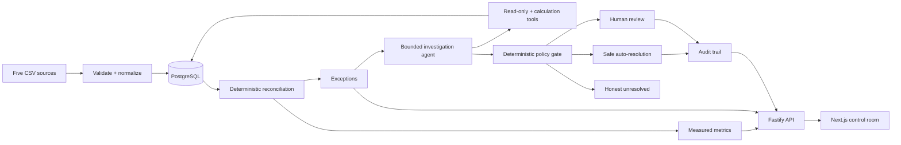

# SettleGuard

SettleGuard is an AI finance controller for settlement reconciliation. It
deterministically matches payments, refunds, settlements, adjustments, and bank
credits; detects discrepancies; then uses a bounded agent to investigate only
the exceptions that need judgment.

Built for the Razorpay AI Buildathon, Track 04 — AI Finance Controller.

## Measured result

| Benchmark | Result |
|---|---:|
| Financial records | 5,855 |
| Payments | 5,000 |
| Match rate | 98.05% |
| Exception precision | 100.00% (125/125) |
| Exception recall | 100.00% (125/125) |
| Reconciliation throughput | 3,901 records/sec |

These values were produced by `npm run benchmark` on the checked-in synthetic
benchmark dataset. They are not UI fixtures. See
[benchmark methodology](docs/BENCHMARK_RESULTS.md) for the full breakdown.

## The problem

Finance teams reconcile records spread across payment processors and bank
statements. A missing settlement, duplicate refund, unexpected adjustment, fee
error, or ambiguous bank credit can require a manual trail through several
systems. A chatbot alone is unsafe here: money calculations and matching must be
repeatable, and every conclusion needs evidence.

SettleGuard separates those responsibilities:

- deterministic code owns normalization, arithmetic, matching, and exception detection;
- a tool-limited agent investigates ambiguous exceptions using retrieved records;
- policy code—not the model—decides whether to auto-resolve, request review, or remain unresolved;
- every controlled action produces an audit entry.

## Architecture



The agent has an exact eight-tool-call budget, schema-validated output, one
repair attempt, grounded evidence IDs, and explicit `AI_ERROR` or insufficient-
evidence outcomes. It cannot issue SQL, modify monetary source records, approve
its own high-risk proposal, or bypass policy thresholds.

## Control room

The Next.js UI provides:

- one-click bundled demo ingestion and reconciliation;
- five-file CSV upload and automatic reconciliation;
- live match, exception, risk, and resolution metrics;
- filtered and paginated exception ledger;
- deterministic evidence, agent trace, conclusion, and confidence detail;
- controlled investigate, approve, reject, and mark-unresolved actions;
- filtered, immutable audit history.

## Quick demo with containers

Prerequisite: Docker with Compose.

```bash
GEMINI_API_KEY=your_key SETTLEGUARD_AGENT_PROVIDER=gemini docker compose up --build
```

Open `http://localhost:3000`, select **Run demo**, open an exception, and inspect
its evidence. Investigation requires a key for the selected Anthropic or Gemini provider; deterministic ingestion,
reconciliation, metrics, exceptions, and audit browsing do not.

## Local development

Prerequisites: Node.js 20.9+ and PostgreSQL 14+.

```bash
# Generate/re-generate datasets
npm install
npm run generate:demo
npm run generate:benchmark
npm run generate:agent-slice

# API (terminal 1)
cd apps/api
npm install
cp .env.example .env
npm run db:push
npm run dev

# Web (terminal 2)
cd apps/web
npm install
cp .env.example .env.local
npm run dev
```

Open `http://localhost:3000`. API health is available at
`http://localhost:4000/health` and checks database readiness.

## Verification

Every push and pull request runs the API build and test suite, web typecheck and
production build, and the real Playwright demo journey against PostgreSQL. The
same checks can be run locally:

```bash
cd apps/api
npm test                 # 43 files, 228 tests
npm run benchmark        # fresh ingest → reconcile → ground-truth scoring
npm audit --omit=dev     # production dependency audit

cd ../web
npm run typecheck
npm run build
npm run test:e2e         # real Chromium P0 operator journey
```

The E2E test starts both services and verifies demo ingestion, reconciliation,
live metrics, exception navigation, evidence detail, and audit navigation against
real PostgreSQL.

## Repository structure

```text
apps/api/       ingestion, reconciliation, benchmark, agent, policy, HTTP API
apps/web/       Next.js control room and Playwright journey
datasets/       demo, benchmark, and focused agent-regression data
scripts/        deterministic synthetic dataset generator
docs/           benchmark evidence, demo script, and known limitations
compose.yaml    PostgreSQL + API + web production-like stack
```

## Submission notes

- [Buildathon submission package](docs/SUBMISSION.md)
- [Benchmark results and methodology](docs/BENCHMARK_RESULTS.md)
- [Three-minute judge demo](docs/DEMO.md)
- [Release verification evidence](docs/RELEASE_VERIFICATION.md)
- [Known limitations](docs/KNOWN_LIMITATIONS.md)

SettleGuard preserves uncertainty instead of hiding it: unsupported or
low-confidence cases stay visible for a person, with the evidence and activity
trail needed to make a defensible decision.
