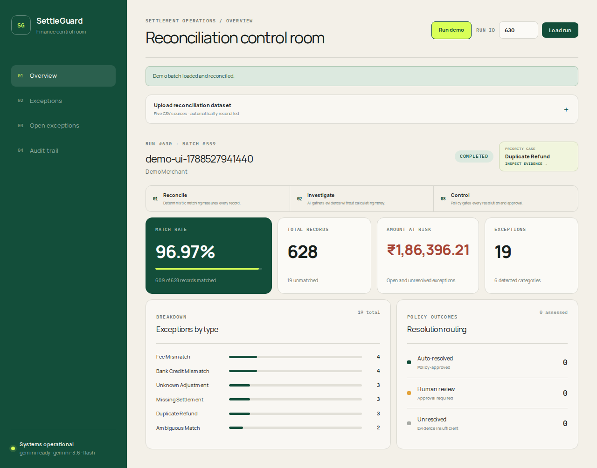
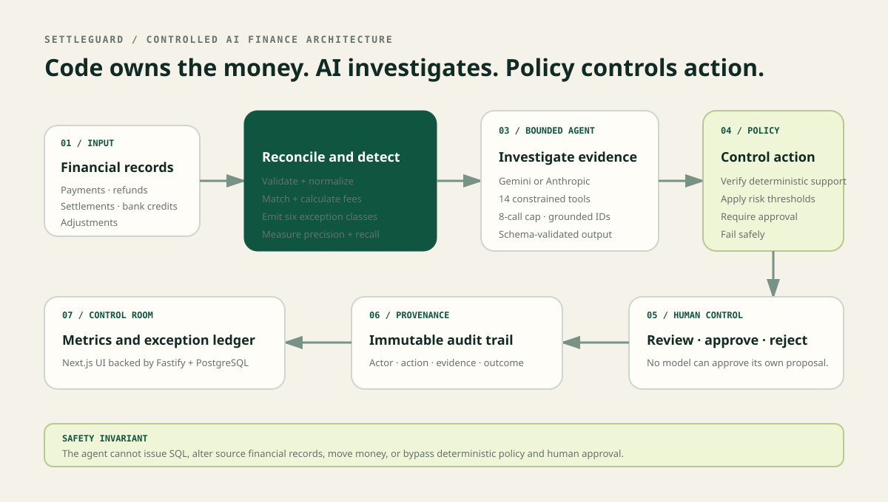
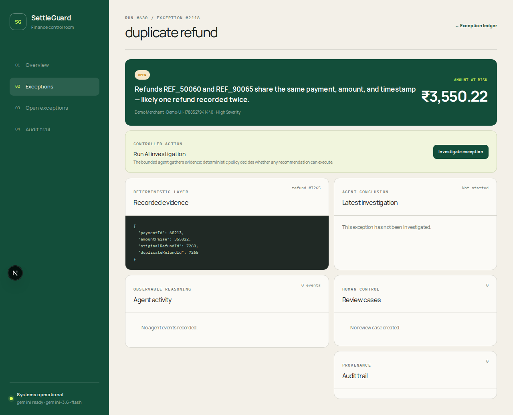

# Razorpay AI Buildathon submission

## Project

**SettleGuard — an evidence-grounded AI finance controller for settlement reconciliation**

Track: **04 — AI Finance Controller**

SettleGuard reconciles payments, refunds, settlements, adjustments, and bank
credits; detects financial discrepancies deterministically; and uses a bounded
AI agent to investigate exceptions without giving the model authority over money.

## Problem

Finance teams manually trace mismatches across processor exports, settlement
reports, refund records, adjustments, and bank statements. Generic AI is unsafe
for this workflow because arithmetic must be reproducible, evidence must be
traceable, and a recommendation must never silently become a financial action.

## Solution

SettleGuard separates the workflow into three controlled layers:

1. **Reconcile:** deterministic ingestion, normalization, monetary arithmetic,
   record matching, and exception detection.
2. **Investigate:** a Gemini or Anthropic agent selects evidence through 14
   constrained tools and returns schema-validated, grounded JSON.
3. **Control:** deterministic policy decides whether to rerun, create a review,
   or remain unresolved; every controlled action is audited.

## What makes it different

- AI never performs authoritative money calculations or writes source records.
- Every cited record ID must have appeared in trusted context or tool output.
- The agent has an eight-tool-call cap and one structured-output repair attempt.
- Ambiguous or unavailable-provider cases preserve evidence and route to human
  review instead of inventing a conclusion.
- Human approval, policy decisions, and action results have an immutable audit
  trail.
- A one-click demo ingests and reconciles real CSV fixtures through the same API
  used by uploaded datasets.

## Measured evidence

Fresh local benchmark, generated with `cd apps/api && npm run benchmark`:

| Measure | Result |
|---|---:|
| Financial records | 5,855 |
| Payments | 5,000 |
| Match rate | 98.05% |
| Injected exceptions | 125 across 6 classes |
| Precision | 100.00% (125/125) |
| Recall | 100.00% (125/125) |
| Reconciliation time | 1,501 ms |
| Throughput | 3,901 records/sec |

The benchmark compares detected exceptions with generator-produced ground truth;
it does not treat UI fixtures or model output as labels. Live-agent evaluation is
kept separate so deterministic accuracy is never confused with model quality.
The full build, test, browser, and production smoke evidence is recorded in
[Release verification](RELEASE_VERIFICATION.md).

## Technology

- TypeScript, Node.js, Fastify, PostgreSQL, and Drizzle ORM
- Next.js and React control room
- Gemini 3.6 Flash and Anthropic provider adapters
- Zod validation, Vitest integration tests, and Playwright browser E2E
- Docker Compose deployment definitions

## Demo

Use the [three-minute judge script](DEMO.md). The shortest path is:

1. Select **Run demo**.
2. Show measured reconciliation metrics and the six exception categories.
3. Select **Inspect evidence** on the priority case.
4. Contrast deterministic evidence with bounded agent activity.
5. Make a human review decision and show the audit trail.

## Submission links

- Repository: **add final repository URL**
- Hosted application: **add deployment URL**
- Demo video: **add video URL**

## Honest scope

This buildathon MVP uses one merchant, synchronous jobs, and reviewer IDs rather
than an identity provider. These boundaries are documented in
[Known limitations](KNOWN_LIMITATIONS.md) and do not weaken the core safety claim:
the model cannot move money, approve itself, or bypass deterministic policy.
